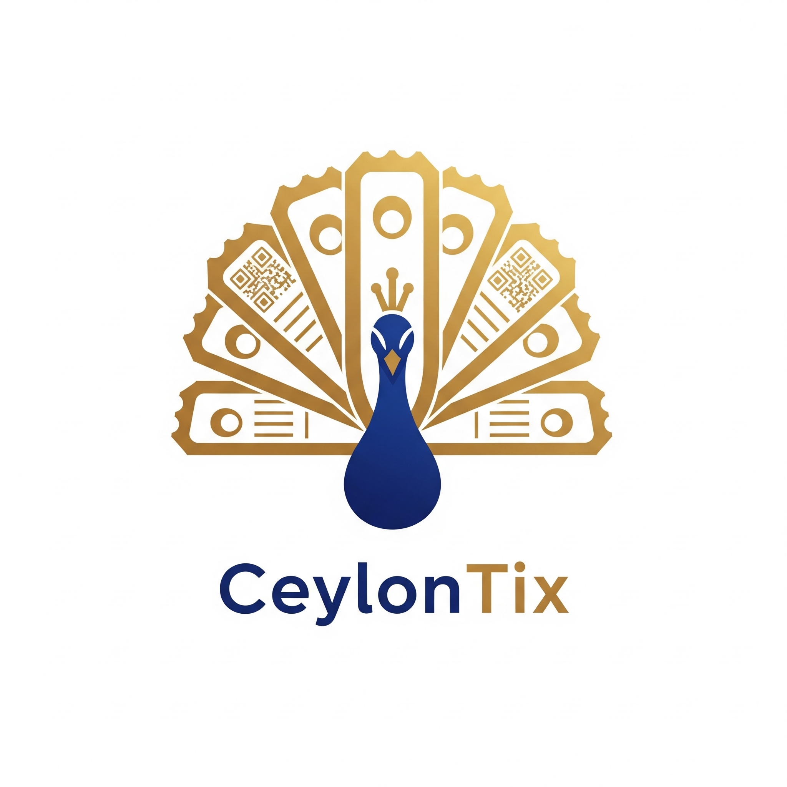

# Ceylontix App

[](https://ampcode.com/threads/T-eaf0d90b-acf4-4bf4-94a8-aba12cc5b9a2)

A Flutter application currently under active development.

## App Logo



## Project Status

- This project is under construction. Features, UI, and APIs may change frequently.
- Issues and tasks are being actively tracked while core functionality is being implemented.

## Platforms and Icons

- Web: favicon and PWA icons generated under `web/` and `web/icons/`.
- Android: launcher icons generated under `android/app/src/main/res/` (mipmap* folders).
- iOS: app icons generated under `ios/Runner/Assets.xcassets/AppIcon.appiconset/`.

All icons are generated from `assets/logo/app_logo.png` using `flutter_launcher_icons` for consistency across platforms.

## Getting Started

1. Ensure Flutter and platform toolchains are installed:
   - Flutter SDK
   - Android Studio / Xcode for mobile targets
2. Fetch dependencies:

```bash
flutter pub get
```

3. Run the app:

```bash
# Web (development)
flutter run -d chrome

# Android (emulator or device)
flutter run -d android

# iOS (simulator or device)
flutter run -d ios
```

## Build

```bash
# Build Web
flutter build web

# Build Android APK (debug)
flutter build apk --debug

# Build Android APK (release)
flutter build apk

# Build iOS (requires macOS)
flutter build ios
```

## Tests

```bash
flutter test
```

## Project Structure

- `lib/` – Application source code
- `assets/` – Images and other bundled assets
- `web/` – Web entrypoint, favicon, and PWA assets
- `android/` – Android project
- `ios/` – iOS project

## Assets

- App logo source: `assets/logo/app_logo.png`
- To add more assets, declare them in `pubspec.yaml` under the `flutter.assets` section.

## Notes

- Since this project is under construction, expect frequent updates and potential breaking changes.
- Feedback and contributions are welcome once the initial milestone is complete.
